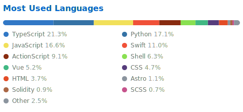

# Abdul Qabiz

### CTO • System Architect • Agentic AI • Distributed Systems

Building internet systems for 20+ years.

From Macromedia Flex and Yahoo! to distributed platforms, video infrastructure, search systems, and Agentic AI.

---

## About Me

I have spent more than two decades designing and building internet scale systems.

My career has evolved through multiple technology eras while remaining centred on one thing: building reliable systems that solve real problems.

My journey spans:

* Macromedia Flex and Flash
* Yahoo! platform engineering
* Video on Demand and DRM systems
* Search and analytics platforms
* Cloud infrastructure
* Blockchain applications
* Agentic AI and multimodal systems

Today I serve as CTO at FreePixel, where I lead platform architecture, infrastructure, search systems, AI initiatives, and product engineering.

---

## Current Focus

* Agentic AI systems
* RAG and vector search
* Distributed architectures
* Infrastructure and observability
* Search and knowledge systems
* Open source technologies

---

## Technology Stack

### AI

Python • Agentic AI • LLM Pipelines • RAG • LLaMA • Multimodal Models • AI Agents

### Infrastructure

Linux • Docker • AWS • GCP • Cloudflare • Nginx • Kubernetes

### Data

Elasticsearch • OpenSearch • Vector Search • Firestore • PostgreSQL

### Backend

Python • FastAPI • Node.js • Celery • REST APIs

### Frontend

React • Next.js • Angular • JavaScript • TypeScript

### Observability

Prometheus • Grafana • OpenTelemetry

---

## GitHub Activity

---

## Languages

---

## Achievements

---

## Popular Repositories & Stars

---

## Topics & Interests

---

## Companies & Projects

### FreePixel

AI powered creative platform focused on search, automation, metadata intelligence, vector search, and generative AI.

### Allies Interactive

Technology partnership and product development for founders and growing businesses for more than seventeen years.

### Diziana

Zendesk themes, applications, and customisation services used by organisations including Cloudflare, Figma, Gates Foundation, Cornell University, Tripadvisor, Nykaa, HelloFresh, and many others.

### IndieReign

Video on Demand platform serving independent filmmakers worldwide with DRM protected streaming infrastructure.

---

## What Interests Me

* Philosophy
* Psychology
* Systems Thinking
* Open Source
* Search Technology
* Artificial Intelligence
* Human Behaviour
* Distributed Systems
* Knowledge Management

---

## Selected Technologies Through the Years

Flash • Flex • ActionScript • PHP • Python • Node.js • Elasticsearch • Docker • Kubernetes • AWS • Cloudflare • LLMs

---

## Connect

* Website: https://www.abdulqabiz.com
* LinkedIn: https://linkedin.com/in/abdulqabiz
* GitHub: https://github.com/abdul
* X: https://x.com/abdulqabiz

---

> Build useful systems. Keep complexity under control. Continue learning.
